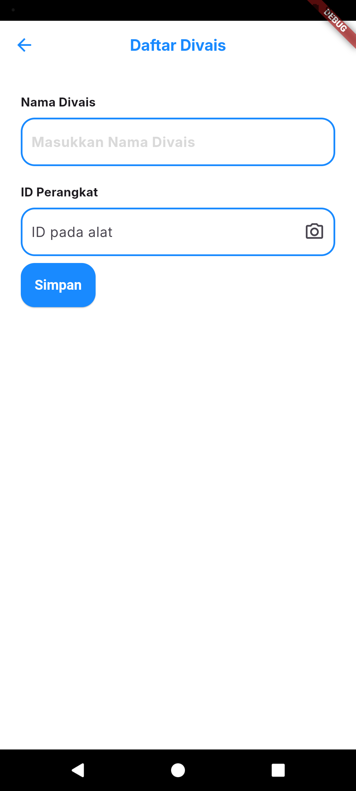
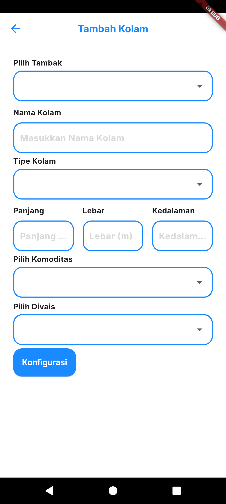
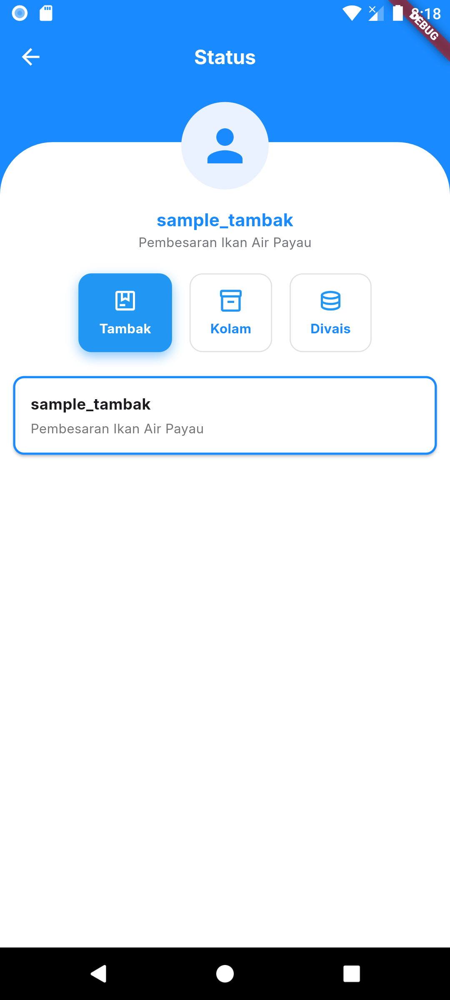
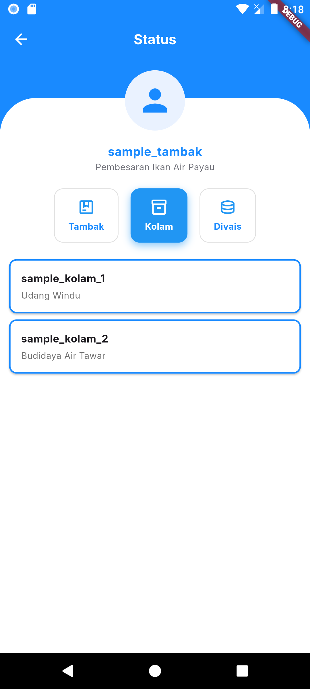
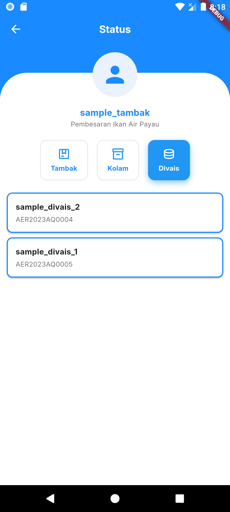

# 🐟 AquaNotes

**AquaNotes** adalah aplikasi mobile berbasis Flutter yang dirancang untuk memantau dan menampilkan data kualitas air di lingkungan budidaya perairan seperti kolam ikan. Aplikasi ini dilengkapi dengan fitur visualisasi data secara real-time dan manajemen perangkat berbasis arsitektur bersih (Clean Architecture).

Aplikasi ini merupakan kerjasama dengan Abdul Salam Achmad, selaku Founder & CEO dari @aerasea.epi

---

## 📱 Pratinjau Aplikasi

---

## 🚀 Fitur Utama

- 📊 Visualisasi data kualitas air (pH, suhu, dan lainnya)
- 🐟 Mendukung banyak kolam dan perangkat
- 💡 UI bersih dan responsif menggunakan Flutter & Cubit (Bloc)
- 🧱 Struktur arsitektur bersih (data, domain, presentasi)
- 🔒 Endpoint API telah disanitasi untuk versi publik ini

---

👨‍💻 Pengembang

- Fakhri Rasyad
- 📧 [kaizerd23@gmail.com]
- 🌐 [www.linkedin.com/in/fakhri-rasyad-5b4a39250]

📄 Lisensi
Proyek ini menggunakan MIT License.

⚠️ Repositori ini hanya untuk keperluan demonstrasi. Konten dan kode bersifat hak milik pribadi/klien dan **tidak tersedia secara open source**.
